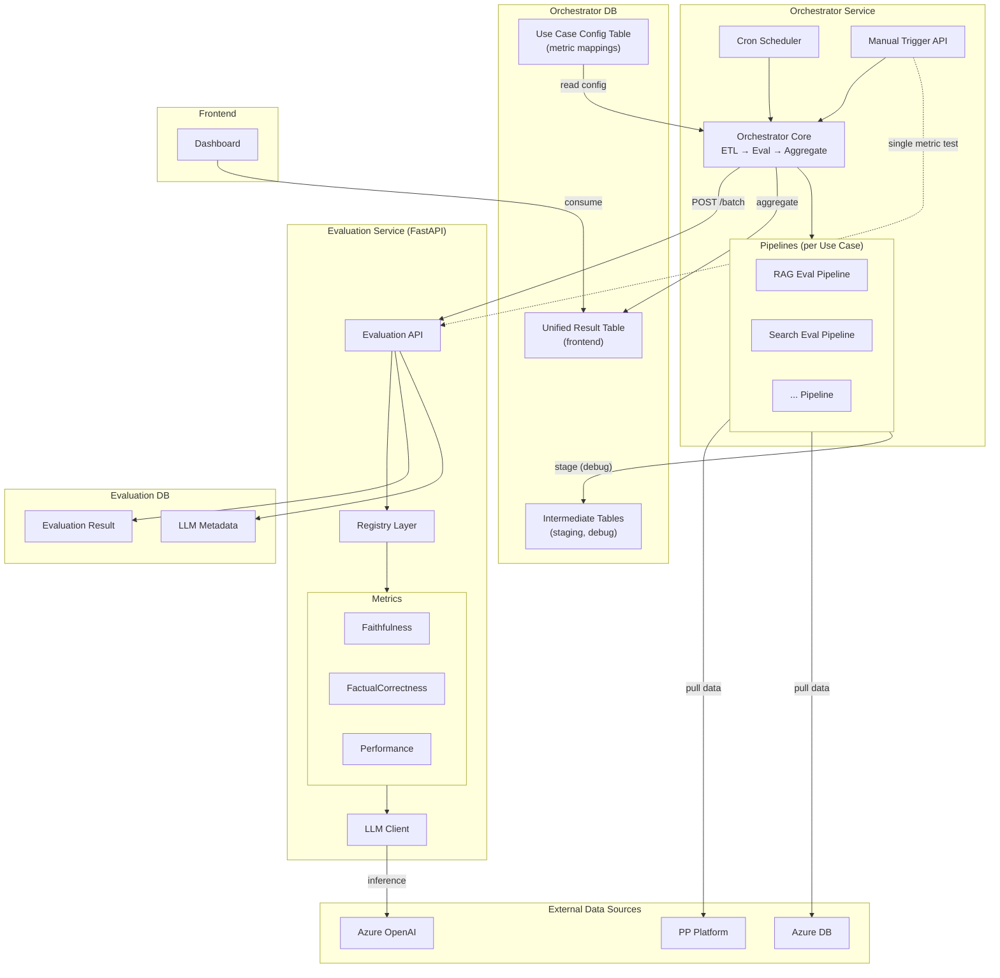
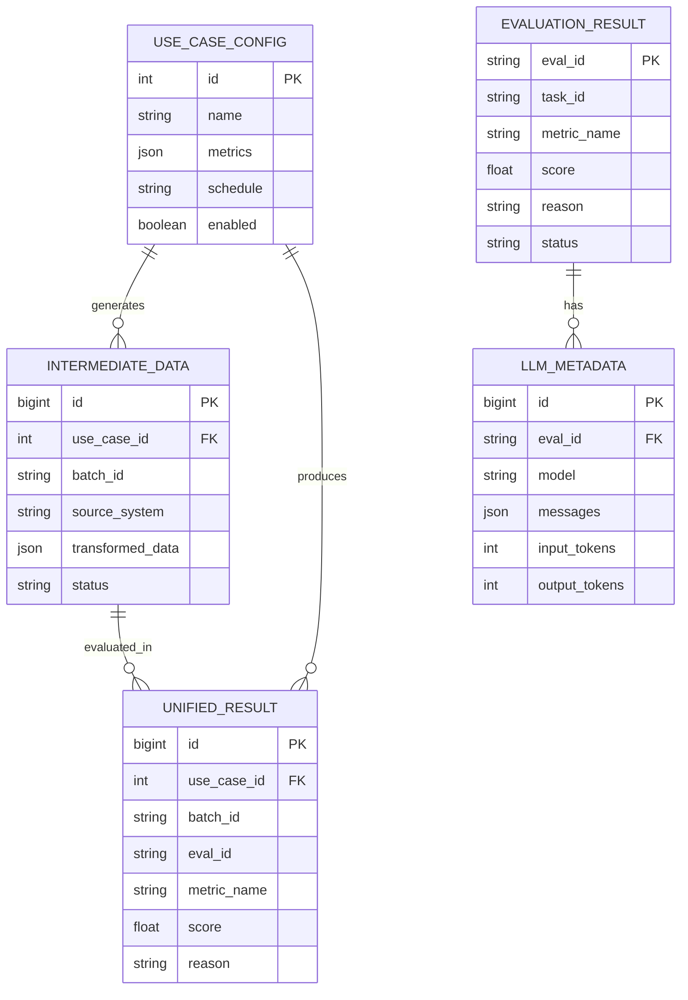
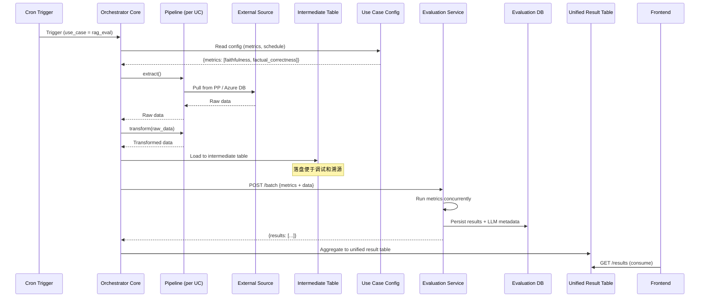
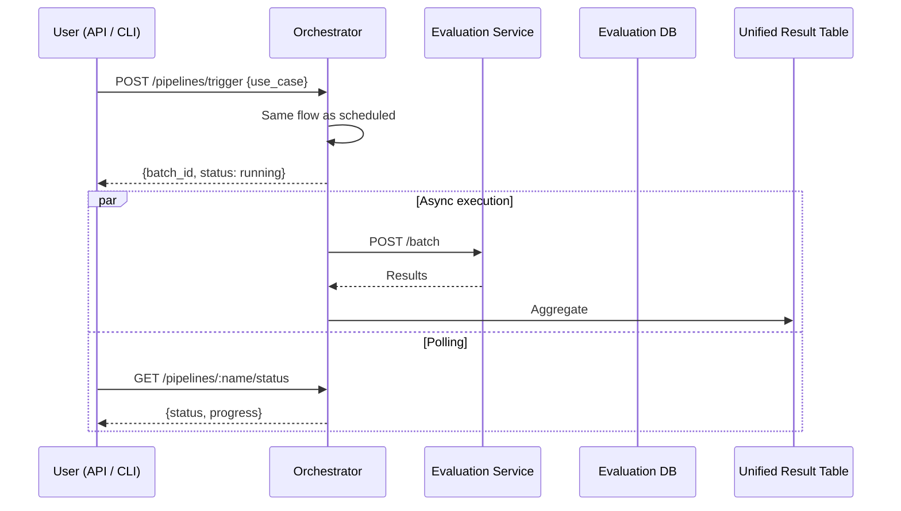
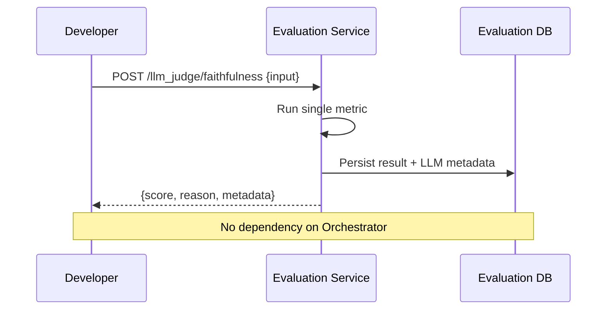

# Software Design Document — LLM Evaluation System

> **Version:** 1.0
> **Date:** 2026-04-15
> **Status:** Draft

---

## 1. Overview

### 1.1 Background

构建一个可复用的 LLM 评估框架。当前首个 use case 是 RAG 场景（Faithfulness、FactualCorrectness），但框架设计不绑定特定场景——后续新增 use case 只需：接入数据源、配置对应的指标组合、注册到调度器，即可自动纳入评估流水线。

### 1.2 Goals

- 建立端到端的自动化评估流水线：数据采集 → 指标计算 → 结果聚合
- 支持多个 use case，每个 use case 可配置不同的数据源和指标组合
- 评估指标可独立测试（offline），也可被调度层批量调用（online）
- 评估结果统一汇总，供前端消费展示

### 1.3 Scope

| In Scope | Out of Scope |
|----------|-------------|
| 数据采集（ETL） | 前端 Dashboard 实现 |
| 评估指标计算 | LLM 模型训练 / 微调 |
| 调度与编排 | 数据源系统的维护 |
| 结果聚合与存储 | 用户权限管理 |

### 1.4 Glossary

| Term | Definition |
|------|-----------|
| Use Case | 一个评估场景，定义了数据来源、转换逻辑和需要跑的指标集合 |
| Pipeline | 一次完整的评估流程：ETL → 评估 → 结果聚合 |
| Metric | 一个具体的评估指标，如 Faithfulness、FactualCorrectness |
| Intermediate Table | ETL 阶段落盘的中间数据表，用于调试和数据溯源 |
| Unified Result Table | 前端消费的统一结果表，聚合了所有 use case 的评估结果 |

---

## 2. System Architecture

### 2.1 Service Topology

系统由 **2 个独立服务** 组成：

```
┌─────────────────────────────────────────────────────────────┐
│                                                             │
│  ┌─────────────────────────┐    ┌────────────────────────┐  │
│  │  Orchestrator Service   │    │  Evaluation Service    │  │
│  │                         │    │  (current repo)        │  │
│  │  - Scheduling (cron)    │───→│                        │  │
│  │  - ETL per use case     │    │  - Metrics computation │  │
│  │  - Result aggregation   │    │  - LLM inference       │  │
│  │  - Manual trigger API   │    │  - Offline test API    │  │
│  └──────────┬──────────────┘    └──────────┬─────────────┘  │
│             │                              │                │
│             ▼                              ▼                │
│  ┌──────────────────┐          ┌────────────────────┐      │
│  │ Orchestrator DB  │          │  Evaluation DB     │      │
│  │ - intermediate   │          │  - result          │      │
│  │ - use_case_config│          │  - llm_metadata    │      │
│  │ - unified_result │          │                    │      │
│  └──────────────────┘          └────────────────────┘      │
│                                                             │
└─────────────────────────────────────────────────────────────┘
```

**为什么是 2 个服务而不是 3 个：**

最初设计将 ETL 和 Scheduler 拆为独立服务，但分析后发现：
- Scheduler 本身只是一个薄编排层，职责不足以独立成服务
- ETL 和调度天然属于同一个生命周期：触发 → 拉数据 → 调评估 → 聚合
- 合并后减少服务间通信开销和运维复杂度
- ETL 以 use case 为粒度模块化，新 use case 通过添加模块接入

**为什么 Evaluation 独立：**

- Evaluation 是无状态的计算服务，可能因 LLM 调用耗时需要独立扩容
- 拥有独立的离线测试入口，开发和测试阶段不依赖 Orchestrator
- 数据完全独立（evaluation DB），不与业务数据耦合

### 2.2 Architecture Diagram (Mermaid)



---

## 3. Component Design

### 3.1 Orchestrator Service

#### 3.1.1 Directory Structure

```
orchestrator_service/
├── main.py                     # Entry point (FastAPI / CLI)
├── config/
│   └── settings.py             # Service-level configuration
├── scheduler/
│   ├── cron_runner.py          # Cron-based scheduling
│   └── manual_api.py           # Manual trigger REST API
├── pipelines/
│   ├── base.py                 # BasePipeline abstract class
│   ├── rag_eval/
│   │   ├── extractor.py        # Pull from PP / Azure DB
│   │   ├── transformer.py      # Clean & normalize
│   │   └── config.yaml         # Metrics to run, schedule, etc.
│   ├── search_eval/
│   │   ├── extractor.py
│   │   ├── transformer.py
│   │   └── config.yaml
│   └── registry.py             # Auto-discover all pipelines
├── orchestrator.py             # Core: ETL → Eval → Aggregate
├── eval_client.py              # HTTP client for Evaluation Service
├── models/
│   ├── intermediate.py         # Intermediate table ORM
│   ├── use_case_config.py      # Use case config table ORM
│   └── unified_result.py       # Unified result table ORM
└── db/
    ├── connection.py
    └── migrations/
```

#### 3.1.2 Pipeline Abstraction

每个 use case 实现为一个 Pipeline 模块，遵循统一接口：

```python
class BasePipeline(ABC):
    name: str                          # Use case identifier
    metrics: list[str]                 # Which metrics to run
    schedule: str                      # Cron expression

    @abstractmethod
    async def extract(self) -> list[dict]:
        """Pull data from external sources."""

    @abstractmethod
    async def transform(self, raw_data: list[dict]) -> list[dict]:
        """Clean, normalize, prepare for evaluation."""

    async def load(self, staged_data: list[dict]) -> None:
        """Persist to intermediate tables (default implementation)."""
```

#### 3.1.3 Orchestrator Core Flow

```
┌──────────┐     ┌──────────┐     ┌──────────┐     ┌──────────┐     ┌──────────┐
│  Trigger  │────→│  Extract  │────→│ Transform │────→│   Load   │────→│  Call    │
│ (cron/    │     │ (per UC)  │     │ (per UC)  │     │ (interm. │     │  Eval    │
│  manual)  │     │           │     │           │     │  table)  │     │  /batch  │
└──────────┘     └──────────┘     └──────────┘     └──────────┘     └─────┬────┘
                                                                         │
                                                                         ▼
                                                                   ┌──────────┐
                                                                   │ Aggregate │
                                                                   │ to unified│
                                                                   │ result    │
                                                                   └──────────┘
```

### 3.2 Evaluation Service (Current Repo)

#### 3.2.1 Three-Layer Architecture

```
┌─────────────────────────────────────────────────┐
│                  API Layer (FastAPI)             │
│  /batch  |  /:evaluator_type/:metric_name  | /health │
├─────────────────────────────────────────────────┤
│                  Registry Layer                  │
│  EvaluatorRegistry → MetricRegistry (per type)  │
├─────────────────────────────────────────────────┤
│                  Evaluators                      │
│  Faithfulness | FactualCorrectness | ...         │
├─────────────────────────────────────────────────┤
│              Infrastructure                      │
│  LLM Utils | LLM Tracker | Background Persist   │
└─────────────────────────────────────────────────┘
```

#### 3.2.2 Key Design Decisions

| Decision | Rationale |
|----------|-----------|
| Duck-typing for metrics | 只需 `name`, `required_fields`, `evaluate` 即可注册，低耦合 |
| Background persistence | 不阻塞 HTTP 响应，结果异步写入 DB |
| ContextVar for LLM config | 支持 per-request 覆盖 LLM 参数，batch 内不同指标可用不同配置 |
| Semaphore-controlled concurrency | batch 接口并发跑多个指标，但限制最大并发数防止 LLM 过载 |

---

## 4. Data Design

### 4.1 Database Ownership

| Database | Owner | Purpose |
|----------|-------|---------|
| Orchestrator DB | Orchestrator Service | 中间表、配置表、统一结果表 |
| Evaluation DB | Evaluation Service | 评估结果、LLM 调用明细 |

两个服务各自拥有自己的数据库，不跨服务直接访问对方数据库。

### 4.2 Orchestrator DB Schema

#### 4.2.1 use_case_config

| Column | Type | Description |
|--------|------|-------------|
| id | INT PK | |
| name | VARCHAR | Use case 唯一标识，如 `rag_eval` |
| description | TEXT | Use case 说明 |
| metrics | JSON | 该 use case 需要跑的指标列表 |
| schedule | VARCHAR | Cron 表达式 |
| source_config | JSON | 数据源连接配置（加密存储） |
| enabled | BOOLEAN | 是否启用 |
| created_at | TIMESTAMP | |
| updated_at | TIMESTAMP | |

#### 4.2.2 intermediate_data

| Column | Type | Description |
|--------|------|-------------|
| id | BIGINT PK | |
| use_case_id | INT FK | 关联 use_case_config |
| batch_id | VARCHAR | 一次 ETL 运行的唯一标识 |
| source_system | VARCHAR | 数据来源（`pp` / `azure_db`） |
| raw_data | JSON | 原始拉取的数据 |
| transformed_data | JSON | 转换后的数据（传给 Eval 的 payload） |
| status | VARCHAR | `staged` / `evaluated` / `failed` |
| created_at | TIMESTAMP | |
| evaluated_at | TIMESTAMP | |

#### 4.2.3 unified_result

| Column | Type | Description |
|--------|------|-------------|
| id | BIGINT PK | |
| use_case_id | INT FK | 关联 use_case_config |
| batch_id | VARCHAR | 关联 intermediate_data |
| eval_id | VARCHAR | Evaluation Service 返回的评估 ID |
| metric_name | VARCHAR | 指标名称 |
| score | FLOAT | 评估分数 |
| reason | TEXT | 评估原因 |
| status | VARCHAR | `success` / `failed` |
| latency_ms | INT | 评估耗时 |
| evaluated_at | TIMESTAMP | |
| created_at | TIMESTAMP | |

### 4.3 Evaluation DB Schema

#### 4.3.1 evaluation_result

| Column | Type | Description |
|--------|------|-------------|
| eval_id | VARCHAR PK | 评估唯一标识 |
| task_id | VARCHAR | 调用方传入的任务标识 |
| evaluator_type | VARCHAR | 评估器类型（`llm_judge` / `performance`） |
| metric_name | VARCHAR | 指标名称 |
| score | FLOAT | |
| reason | TEXT | |
| status | VARCHAR | `success` / `failed` |
| error_code | VARCHAR | 失败时的错误码 |
| latency_ms | INT | |
| llm_config | JSON | 使用的 LLM 配置 |
| input_data | JSON | 评估输入（用于溯源） |
| created_at | TIMESTAMP | |

#### 4.3.2 llm_metadata

| Column | Type | Description |
|--------|------|-------------|
| id | BIGINT PK | |
| eval_id | VARCHAR FK | 关联 evaluation_result |
| model | VARCHAR | LLM 模型名称 |
| prompt_template | TEXT | 使用的 prompt 模板 |
| messages | JSON | 完整的 LLM 对话 |
| response | TEXT | LLM 原始回复 |
| input_tokens | INT | |
| output_tokens | INT | |
| latency_ms | INT | |
| attempt | INT | 重试次数 |
| created_at | TIMESTAMP | |

### 4.4 Entity Relationship



---

## 5. API Design

### 5.1 Evaluation Service API

Evaluation Service 提供两类接口：

| Interface | Consumer | Purpose |
|-----------|----------|---------|
| `POST /batch` | Orchestrator | 批量评估，一次请求跑多个指标 |
| `POST /:type/:metric` | Developer / Orchestrator | 单指标评估，用于离线测试或按需调用 |
| `GET /health` | All | 健康检查 |

#### 5.1.1 POST /api/v1/evaluation/batch

**Request:**

```json
{
  "task_id": "rag_eval_20260415_001",
  "evaluations": [
    {
      "evaluator_type": "llm_judge",
      "metric_name": "faithfulness",
      "input": {
        "query": "What is the policy on...",
        "response": "According to the document...",
        "context": ["doc1: ...", "doc2: ..."]
      }
    },
    {
      "evaluator_type": "llm_judge",
      "metric_name": "factual_correctness",
      "input": {
        "response": "According to the document...",
        "reference": "The policy states that..."
      }
    }
  ],
  "llm_config": {
    "model": "gpt-4",
    "temperature": 0.1
  }
}
```

**Response:**

```json
{
  "task_id": "rag_eval_20260415_001",
  "results": [
    {
      "evaluator_type": "llm_judge",
      "metric_name": "faithfulness",
      "score": 0.85,
      "reason": "Most claims are supported by context...",
      "status": "success"
    },
    {
      "evaluator_type": "llm_judge",
      "metric_name": "factual_correctness",
      "score": 0.72,
      "reason": "Precision: 0.8, Recall: 0.65, F1: 0.72",
      "status": "success"
    }
  ],
  "metadata": {
    "total_latency_ms": 3200,
    "evaluated_at": "2026-04-15T10:30:00Z"
  }
}
```

#### 5.1.2 POST /api/v1/evaluation/:evaluator_type/:metric_name

**Request:**

```json
{
  "task_id": "offline_test_001",
  "input": {
    "query": "What is the policy on...",
    "response": "According to the document...",
    "context": ["doc1: ...", "doc2: ..."]
  },
  "llm_config": {
    "model": "gpt-4",
    "temperature": 0.1
  }
}
```

**Response:**

```json
{
  "eval_id": "eval_abc123",
  "evaluator_type": "llm_judge",
  "metric_name": "faithfulness",
  "score": 0.85,
  "reason": "Most claims are supported by context...",
  "status": "success",
  "metadata": {
    "latency_ms": 2100,
    "evaluated_at": "2026-04-15T10:35:00Z"
  }
}
```

### 5.2 Orchestrator Service API

| Interface | Consumer | Purpose |
|-----------|----------|---------|
| `POST /pipelines/trigger` | Frontend / CLI | 手动触发指定 use case |
| `GET /pipelines` | Frontend | 查看所有 pipeline 状态 |
| `GET /pipelines/:name/status` | Frontend | 查看单个 pipeline 运行状态 |
| `GET /results` | Frontend | 查询统一结果 |
| `GET /results/:use_case` | Frontend | 按 use case 查询结果 |

#### 5.2.1 POST /pipelines/trigger

**Request:**

```json
{
  "use_case": "rag_eval",
  "batch_id": "manual_20260415_001",
  "override_config": {
    "metrics": ["faithfulness"],
    "schedule": null
  }
}
```

**Response:**

```json
{
  "batch_id": "manual_20260415_001",
  "use_case": "rag_eval",
  "status": "running",
  "triggered_at": "2026-04-15T10:40:00Z"
}
```

#### 5.2.2 GET /results?use_case=rag_eval

**Response:**

```json
{
  "use_case": "rag_eval",
  "results": [
    {
      "batch_id": "20260415_001",
      "metric_name": "faithfulness",
      "score": 0.85,
      "status": "success",
      "evaluated_at": "2026-04-15T10:30:00Z"
    }
  ],
  "pagination": {
    "total": 150,
    "page": 1,
    "page_size": 20
  }
}
```

---

## 6. Data Flow

### 6.1 Scheduled Pipeline Run



### 6.2 Manual Trigger



### 6.3 Offline Single Metric Test



### 6.4 Adding a New Use Case

```mermaid
flowchart LR
    A[1. Add pipeline module\npipelines/new_use_case/] --> B[2. Add config.yaml\n(metrics, schedule)]
    B --> C[3. Register in\nuse_case_config table]
    C --> D[4. Done\nauto-discovered by\nOrchestrator]
```

---

## Appendix A: Service Comparison

| Dimension | Orchestrator Service | Evaluation Service |
|-----------|---------------------|-------------------|
| Language | Python | Python (FastAPI) |
| State | Stateful (DB, schedule) | Stateless |
| Scaling | Low (single instance) | Medium (LLM-bound) |
| Data coupling | Strong (business data) | Weak (evaluation only) |
| DB | Orchestrator DB | Evaluation DB |
| Primary consumer | Cron / Frontend | Orchestrator / Developer |
| Change frequency | Medium (new use case) | High (new metrics) |
